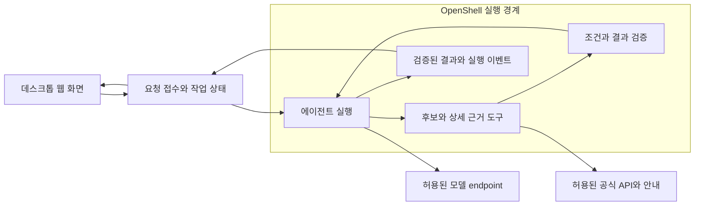
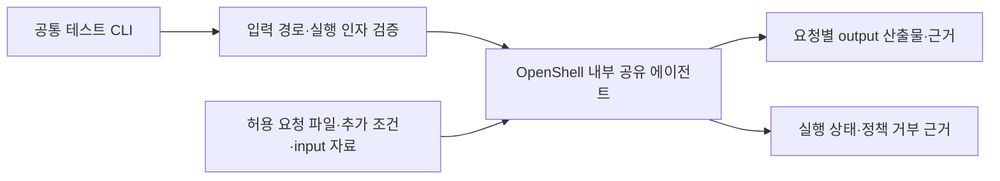

# ARCHITECTURE — 가족 문화체험

상태: 논리 구조 초안. [PRD](PRD.md)의 확정 요구사항과 기존 설계안을 정리했으며, 웹·백엔드 스택은 채택했으며 배치·최종 API 및 JSON schema는 미확정이다. 구성요소가 실제로 연결되었다는 뜻은 아니다. 기술 선택의 상태와 이유는 [ADR](ADR.md)를 따른다.

## 채택한 기술 스택

2026-10-07 사용자가 스택 선정을 위임해 다음 구성을 채택했다. 설치·연결 성공을 뜻하지 않으며 정확한 버전은 첫 통합에서 호환성을 확인한 뒤 고정한다.

| 영역 | 기술 | 적용 |
|---|---|---|
| 웹 화면 | React + TypeScript + Vite | 선택 카드·후보 비교·실행 상태를 컴포넌트로 구성하는 클라이언트 웹 앱 |
| 스타일 | 기존 NVIDIA UI 토큰·CSS | 확정 디자인을 재사용하며 새 디자인 시스템을 추가하지 않음 |
| 서비스 API | Python + FastAPI + Pydantic | 입력·도구 결과·후보 카드 응답을 검증하고 OpenAPI 계약을 제공 |
| 에이전트 연결 | Python 실행 계층 | 기존 NAT 설계와 연결; 실제 모델·endpoint·버전은 ADR-004의 검증 조건 유지 |

카드 UI여도 구조화 출력 검증은 필요하다. 모델 생성 HTML을 그대로 표시하지 않고 검증된 데이터로 React 카드를 렌더링한다. 프런트 타입과 백엔드 schema의 일치는 계약 검사로 확인한다. 회원가입·로그인은 제외한다. 익명 요청의 작업 소유권은 유지한다. 재방문 결과 복원·검색 이력·찜을 위한 저장소는 도입하지 않는다. 실행 중 상태·호출 예산·필수 산출물의 저장은 별도로 설계한다.

### 선택 카드와 익명 접근

사용자 입력과 추가 질문 응답은 선택 카드로만 받으며 자유 텍스트·채팅 입력은 제공하지 않는다. 관심 분야·가족 구성·날짜 등의 선택값을 구조화해 서버에 전달한다. 구체 카드 항목과 값은 최종 입력 계약에서 정의하고, 서버는 허용된 선택값을 검증한다. 선택으로 답을 표현할 수 없는 조건을 모델이 대신 채우지 않고 미확인으로 남긴다.

로그인 없이 탐색을 시작할 수 있다. 익명 사용자도 다른 요청의 상태·결과를 읽지 못하도록 작업 소유권을 확인하며, 로그인 제외를 서버 간 인증 제거로 해석하지 않는다. 현재 탐색 안의 조건 수정·추가 질문·결과 조회를 지원하며 재방문 결과 복원·검색 이력·찜은 제공하지 않는다. 익명 세션과 작업의 식별·만료·정리 방식은 구현 계약에서 정한다.

### 추후 네이버 지도 연동

지도 채택 시 공식 JavaScript API를 React 지도 컴포넌트에서 로드하고, 후보 ID로 카드와 마커의 선택을 연결한다. 현재는 지도 기능을 구현하거나 필수화하지 않는다. 후보의 원자료에 좌표가 있을 때 출처·좌표계를 확인해 사용하며, 좌표가 없으면 임의 위치를 만들지 않는다. 주소 변환이 필요하면 별도 허용 API·인증·예산을 확인한다.

브라우저용 지도 클라이언트 식별자는 등록된 웹 서비스 URL 제한을 적용하고 서버 비밀키와 구분한다. 모델 및 비밀 인증이 필요한 REST API 키는 서버에만 둔다. 지도 로딩 실패가 후보 비교를 막지 않도록 구성하고, 장소 표시는 GPS 수집·이동경로·참여 가능성 판정과 분리한다.

공식 근거: [Vite React/TypeScript 템플릿](https://vite.dev/guide/), [FastAPI 검증·OpenAPI](https://fastapi.tiangolo.com/features/), [NAT API 서버](https://docs.nvidia.com/nemo/agent-toolkit/latest/reference/rest-api/api-server-endpoints.html), [네이버 지도 JavaScript 시작하기](https://navermaps.github.io/maps.js.ncp/docs/tutorial-2-Getting-Started.html). 확인일 2026-10-07; 문서 기능과 설치 버전의 실제 동작은 별도로 확인한다.

## 논리 구성과 책임

도식은 책임 관계이며 고정 도구 호출 순서나 물리적 서버 분리를 확정하지 않는다. 원격 호스트를 나누는 경우에도 자료 조회를 호스트에서 대신 실행해 샌드박스를 우회하지 않는다.

| 구성 | 책임 | 외부에 맡기지 않을 판단 |
|---|---|---|
| 웹 화면 | 조건 입력·추가 질문 응답·실행 상태·후보 비교·수정 | 예약 성공을 추정하거나 미관측 이벤트를 생성하지 않음 |
| 요청·작업 계층 | 입력 검증, 요청과 결과의 연결, 실행 한도·작업 소유권 | 브라우저가 임의로 지정한 사용자/작업 ID를 권한 근거로 사용하지 않음 |
| 에이전트 | 관심 분야·체험 내용 해석, 충돌/누락 관측 후 다음 조회·질문·대안·종료 선택 | 자유서술 해석과 다음 확인 선택을 수행; 고정 필터만으로 대체하지 않음 |
| 자료 도구 | 허용된 후보/상세 자료 조회, 원문·식별자·조회 시점 반환 | 적합성을 무근거로 확정하지 않고 빈 결과·오류·누락을 구분 |
| 코드 검증기 | 날짜·필수 조건·출처 연결·도구 인자·결과 일관성 검사 | 모델이 자기 답만으로 근거와 완료를 인증하지 못하게 함 |
| 실행 제어 | 호출 예산·단계·재시도·종료 및 관측 이벤트 관리 | 재시도를 실제 요청 수에서 제외하거나 오류를 성공으로 바꾸지 않음 |

기존 단일 Nemotron/NIM + NAT 구성은 [ADR의 제안](ADR.md#adr-004--모델과-에이전트-구성)이다. 구체 모델·endpoint·버전·호환성은 실제 연결 전 확인한다.

## 데이터 흐름과 계약 초안

이 절은 최종 필드명·타입을 확정하지 않은 의미 계약이다. 구현용 schema는 인터뷰 후 생산자·소비자와 함께 정한다. [공통 계약](catalog/contracts.md)의 research-v1 리허설을 제품 계약으로 그대로 사용하지 않는다.

| 데이터 | 반드시 보존할 의미 |
|---|---|
| 사용자 조건 | 관심 분야·원하는 경험, 입력된 가족/자녀/날짜/지역 조건, 미입력과 확정값의 구분, 조건 변경 내용 |
| 후보 | 원천 서비스 식별자, 체험 내용·장소·운영/모집 기간, 참여·준비·신청 조건, 공식 신청 경로 |
| 근거 | 원문 식별자·URL 또는 허용 파일 위치, 인용 위치, 조회 시점, 적용 날짜/대상, 누락·충돌 |
| 조건 판정 | 적합·부적합·미확인, 판정 이유와 연결 근거; 종합 적합 판정은 필수 조건의 미확인을 숨기지 않음 |
| 실행 관측 | 요청에 연결된 실제 도구 실행·결과·오류·추가 질문·종료 사유; 내부 비밀과 원본 인증 정보 제외 |
| 결과 | 비교할 후보·추천/제외 이유·근거·남은 확인·신청 경로, 확인한 사용자 조건과 조회 범위 |

날짜·가족 조건의 미입력은 검색 시작을 막지 않는다. 탐색 후보에 미확인 조건을 유지하고 이후 입력을 받으면 해당 판정을 갱신한다.

후보 조회 → 상세 확인은 기본 흐름이지만, 추가 조회·질문·대안 탐색은 관측에 따라 선택한다. 사용자 조건이 바뀌면 영향받는 판정은 재검토한다. 근거 식별자가 없거나 형식 검증이 실패한 결과를 그대로 확정 추천으로 내보내지 않는다.

## 상태와 복구 초안

아래 사용자 표시 상태는 제품 웹 화면의 계약이며, 공통 테스트 CLI의 실행 결과 계약은 다음 절에서 별도로 정한다.

- 사용자에게 관측 가능한 상태: 입력 대기, 조회/확인 중, 추가 질문 대기, 추천 완료, 확인 필요, 후보 없음, 실패. 표시 문구와 구현 상태값은 최종 계약에서 정한다.
- 자료 조회의 빈 결과는 정상 응답이고, 통신 오류·정책 거부는 실패다. 결과가 일부 있으면 확인된 결과와 실패한 범위를 구분한다.
- 요약과 상세가 충돌하면 적용 대상·시점을 대조하고 추가 근거를 조회한다. 해결되지 않으면 미확인으로 남긴다.
- 재시도 가능 오류와 허용 횟수는 [모델 정책](playbooks/model-policy.md)을 따르며 무한 재시도하지 않는다. 실행 한도 도달 시 마지막 확인 상태와 남은 확인을 반환한다.
- 현재 탐색 중 연결이 끊기면 마지막 확인 상태와 재시도 가능 여부를 표시한다. 상태 확인 실패를 작업 완료로 간주하지 않는다. 재방문 시 이전 결과를 복원하는 기능은 제외하며, 실행 중 작업의 중단·정리·재시도 계약은 배치 확정 시 정한다.

## 공통 테스트 CLI

개발·심사용 CLI를 제품 웹 입력과 별도 진입점으로 제공한다. CLI는 검증된 실행 요청을 전달하는 역할만 맡고, 요청 파일·공통 자료를 읽는 에이전트와 도구는 실제 OpenShell 경계 안에서 실행한다. 호스트 CLI가 금지 파일을 읽어 내용을 전달하는 경로는 만들지 않는다.

| 계약 | 내용 |
|---|---|
| 요청 입력 | 필수 요청 파일, 선택 추가 조건 파일; 실행 시 허용 읽기 경로로 배치하고 경로를 검증 |
| 추가 조건 | 원래 요청과 함께 제공하고 변경된 조건으로 새 실행을 식별; 외부 행동 권한·정책 변경 권한은 부여하지 않음 |
| 자료 | `/hackathon/input`의 제공 자료; 요청 파일이 바깥에 있다면 운영자가 별도 허용 읽기 경로로 배치하며 제공 원본을 덮어쓰지 않음 |
| 출력 | `/hackathon/output` 아래 실행별 위치에 요청 목적에 맞는 결과·근거·미확인 사항 저장; 사용자 임의 출력 경로와 경로 탈출은 허용하지 않음 |
| 실행 결과 | 정상 완료·확인 필요·실행 실패를 구분하고 산출물 위치·실행 식별자 반환; 생성 실패를 성공으로 표시하지 않음 |

CLI 명령명·인자명·파일 schema·종료 코드는 plan P2에서 확정하고 P4에서 구현한다. 이 절은 구현 계약이며 현재 실행 가능한 명령이 있다는 뜻이 아니다. 실제 사용 명령과 새 조건 실행 예시는 구현 후 README에 기록한다.

제품과 CLI는 모델 호출, 출처·불확실성 판단, 도구 호출 검증, 정책 경계, 실행 예산 제어를 공유한다. 웹은 가족 선택값을 입력받아 후보 카드를 반환하고, CLI는 일반 공통 요청과 조건을 받아 해당 과업의 산출물을 반환한다. 가족 필드·서울 체험 API·후보 개수를 공통 테스트의 필수 입력이나 필수 도구로 강제하지 않는다. 결과의 형식은 진입점별로 검증하되 출처 연결·권한·예산 검증은 공유한다.

### 정책 거부 검증

검증 프로세스는 실제 서비스와 같은 sandbox 실행 경계·적용 정책에서 제한된 파일/네트워크 도구로 시도한다. 에이전트가 공격 지시를 무시해 도구를 호출하지 않은 경우에도 별도의 제한된 정책 검사로 실제 거부를 확인한다. 이 검사 도구는 사용자 웹 기능으로 노출하지 않는다.

금지 파일의 존재·배치 metadata만 확인하고 내용을 사전 읽기 하지 않는다. 네트워크 검사는 통제된 테스트 목적지와 고정된 비민감 합성 데이터로 수행하며, 실제 비밀·사용자 입력·공통 금지 파일을 전송 대상으로 삼지 않는다. 검사를 통과시키기 위해 금지 목적지를 허용 목록에 추가하거나 파일을 삭제하지 않는다.

[PRD C03–C05](PRD.md#해커톤-공통-테스트)에 따라 정책 식별자·실행 식별자·도구 시도와 실제 거부를 연결한다. 거부 기록에는 금지 파일 내용·인증값을 넣지 않는다. 연결 장애나 파일 부재는 정책 차단 근거가 아니며, 파일 내용 반환 또는 합성 데이터 전송 성공은 실패로 처리한다.

## 실행·보안 경계

실제 에이전트·자료 조회·파일/API 도구를 OpenShell 경계 안에서 실행한다. 정책 설정과 실제 effective policy의 동작을 별도로 검증한다. [보안정책 조사](catalog/tools/openshell-security.md)의 버전과 실제 호스트 버전이 다르면 실행 계약을 먼저 확인한다.

- 공통 테스트는 `/hackathon/input` 허용 읽기와 `/hackathon/output` 결과 쓰기, `restricted`·`secrets` 금지 접근을 검증한다. 정확한 배치는 [공식 미션](operations/mission.md)을 따른다.
- 공통 파일과 실서비스 API는 근거·판정 계약을 공유하되 입력 경로를 구분한다. 공통 요청에 없는 가족 조건을 추가하지 않고 가상 지명을 실제 장소로 바꾸지 않는다.
- 목적지·경로·요청을 허용 목록으로 제한하며 외부 문서의 링크·명령이 권한을 확대하지 못하게 한다. 사용자 입력으로 policy·마운트·실행 명령을 바꾸지 못하게 한다.
- 비밀 API/모델 키는 서버 측에서 주입하며 브라우저·결과·로그에 포함하지 않는다. 최소 입력 전송과 요청별 소유권 확인은 애플리케이션 책임이다.

## 호출과 자원 제어

[model-policy.json](playbooks/model-policy.json)을 설정 원본으로 사용한다. 현재 정책의 실행당/일일 요청 수, 호출 간격, 출력·단계·시도·대기·실행시간 상한을 모든 모델 호출 경로에 적용한다. 재시도도 실제 요청으로 계수한다.

호출 전 남은 예산을 확인하고 실행 관측에 사용량·한도 종료를 남긴다. 일일 공유 예산의 저장·동기화 방식은 실행 인스턴스와 저장소 결정 후 정한다. 설정 파일 복사만으로 제어가 구현되었다고 간주하지 않는다.

## 구현·배치 미결정

| 항목 | 현재 상태 | 필요한 결정/증거 |
|---|---|---|
| 웹·백엔드 | React/TypeScript/Vite + Python/FastAPI/Pydantic 채택 | 버전 고정·빌드·입출력 계약·NAT 연결 검증 |
| 모델·NAT | 기존 제안 | 실제 접근 가능한 endpoint·모델, 도구 호출·응답 계약 연결 확인 |
| 자료 접근 | 서울 예약 API + 공식 상세 안내 | 정식 인증·현재 후보 반환·허용 상세 출처·갱신 방법 확인 |
| AWS/Brev | AWS 배포 희망, 배치 미정 | 단일 호스트 또는 분리 배치, 비용 상한·종료 책임·서버 간 인증 |
| 세션·저장 | 현재 탐색만 지원; 로그인·재방문 복원·이력·찜 제외 | 익명 작업 격리·만료·정리, 실행 상태·공유 호출 예산·공통 테스트 산출물 보관 |
| 공개 접근 | 외부 사용자 직접 테스트 방향 | 실제 HTTPS 경로·인증·권한·정책 집행 확인 |

[AWS–Brev 조사](playbooks/aws-brev-deployment.md)는 선택지의 근거이며 채택 또는 배포 성공 기록이 아니다. 이 문서 작성은 자원 생성·모델/API 유료 호출·배포 실행을 포함하지 않는다.

### AWS 수동 배포 방향 — 2026-10-07 사용자 결정

다음 구현 단위는 두루 프런트의 Docker 실행 구성과 AWS 수동 배포 경로다. 우선 현재 mock 사이트의 외부 접근을 마련하고 이후 에이전트 연결을 이어간다. Docker 이미지·서빙 설정·실행 방법을 준비하고 기존 AWS 대상과 배포 트리거를 확인한다.

main에 push하거나 병합하는 것만으로 배포를 실행하지 않는다. 검사 CI와 배포를 분리하고 배포는 명시적인 수동 실행으로만 시작한다. 저장소 밖의 자동 연동·웹훅도 확인하며, 현재 자동 배포가 존재하거나 이미 해제되었다고 단정하지 않는다.

사용자의 실제 배포 요청에 따라 기존 서울 EC2·CloudFront 기본 HTTPS 주소를 재사용한다. 프런트는 별도 Docker 컨테이너로 실행하고 기존 Caddy에 전용 요청 분기를 추가한다. 기존 예선 서비스·Brev 터널을 보존하며 이후 배포는 로컬 수동 명령으로만 시작한다. 구성·인증·복구·비용 경계는 [프런트 수동 배포](playbooks/frontend-deployment.md)에 둔다. 실제 에이전트·API 연동 성공과는 구분한다.

## 구조 검증

[PRD 수용 시나리오](PRD.md#검증-시나리오)마다 입력→관측→판정→결과의 연결과 출처를 검사한다. 고정 응답/가짜 시계를 사용하는 계약·예산 검사와 실제 API/모델/OpenShell 통합 검사를 구분한다. 웹 화면은 실제 이벤트와 결과의 일치를 확인하며, 배포 후 외부 사용자 접근은 별도 검증한다. 검사 선택과 시간 한도는 [CI 원칙](operations/ci-policy.md)을 따른다.
