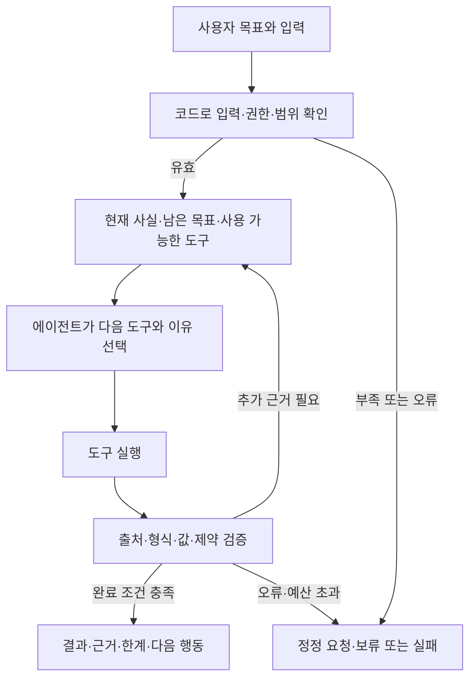

# 문제에서 해결까지: 도구를 선택하는 에이전트 흐름

사용자가 유지하기로 한 핵심은 **문제와 관측 상태를 보고 에이전트가 필요한 도구를 선택해 해결하는 구조**다. 아래는 실행/판단 구조이며 당일 작업 시간표가 아니다.

## 역할과 계약

| 담당 | 맡길 일 | 맡기지 않을 일 |
|---|---|---|
| 사용자/미션 | 해결할 문제, 입력, 성공 기준 | 기술 이름만으로 목표 대체 |
| 에이전트 | 관측을 해석하고 허용 도구 중 다음 행동·추가 수집·종료 선택 | 없는 근거/수치 생성, 입력 오류를 무시한 실행 |
| 도구 | 검색·계산·예측·외부 작업으로 실제 산출물 생성 | 이름만 존재하는 가짜 실행 |
| 코드 검증기 | 입력/권한/순서/예산, 반환값/출처/제약·완료 조건 확인 | 검산 불가능한 모델 신뢰도를 정답으로 승인 |
| 결과 화면/파일 | 관찰된 단계, 선택 이유 요약, 결과·근거·보류 이유 | 내부 추론 전문 노출, mock/replay를 live로 표시 |

상세 상태·입출력 계약은 [하네스](harness.md)를 따른다. 모델·agent·제품/도구·스킬의 역할은 [카탈로그](../catalog/README.md), 미션별 초기 조합은 [실행 안내](README.md)에 있다.

## Bio-3에서 실제로 보여준 선택

- 일치하는 실험 구조가 있음 → 기존 구조 재사용 → 예측을 생략한 이유 기록.
- 쓸 수 있는 복합체 구조가 없고 입력이 충분함 → Boltz-2 예측 → 좌표/서열 검증 → 계산.
- 구조가 있어도 좌표 조건·입력·근거가 부족함 → 해당 계산/판단 보류 → 필요한 다음 자료 제시.

중요한 것은 도구를 모두 호출하는 것이 아니라 **다른 상태에서 적절한 행동으로 바뀌는 것**이다. [Bio-3 분석](../evaluation/bio3-review.md)에 실제 실행 근거와 한계를 구분했다.

## 새 주제에서 확인할 최소 질문

1. 입력/관측이 무엇일 때 선택지가 달라지는가?
2. 각 도구는 실제로 무엇을 입력받고 어떤 근거를 반환하는가?
3. 성공·추가 수집·보류·실패를 어떤 독립 기준으로 판정하는가?
4. 고정 규칙/직접 검색보다 에이전트가 맡을 판단이 있는가?
5. 정상·변화·자료 부족/실패 입력에서 그 차이가 기록되는가?

순서가 항상 같고 관측에 따라 선택할 필요가 없다면 고정 workflow를 사용할 수 있다. 다중 에이전트는 필요성이 확인될 때 추가한다. 도구 수·모델 크기 자체는 루브릭의 득점 조건이 아니다.

## 평가로 이어가기

[승인된 100점 루브릭](../evaluation/rubric.md) → [채점 방법](../evaluation/scoring-guide.md) → `$agent-rubric`.
`agent-rubric`은 근거를 검토해 점수·미확인·먼저 고칠 항목을 정리하며 스케줄을 만들거나 제품을 자동 수정하지 않는다.
