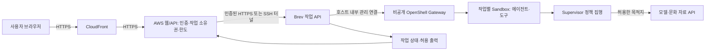

# AWS 웹서비스와 Brev OpenShell 연동

조사 기준: **2026-10-07, 한국 시간**. 이 문서는 배포 설계와 이후 실행 절차다. AWS/Brev 리소스 생성·시작, 계정 연결, 키 발급, 방화벽 변경, 실제 서버 간 호출은 수행하지 않았다. 아래 API 경로·서비스 이름·포트는 **팀 제안 예시이며 현재 구현된 API가 아니다**.

OpenShell 호스트 설치와 파일·통신 정책 검사는 [Brev OpenShell 설치 가이드](brev-openshell-setup.md), 사용자 공개의 공통 조건은 [배포 준비](openshell-deployment.md), 호출 한도는 [모델 정책](model-policy.md)을 재사용한다. 본 문서는 그 사이의 **AWS ↔ Brev 연결**을 설명한다.

## 1. Brev와 AWS가 연결된다는 뜻

AWS는 사용자에게 화면·작업 API를 제공하고, Brev VM은 OpenShell 안에서 에이전트·도구를 실행하도록 나눌 수 있다. 이때 필요한 것은 **인증된 서버 간 통신과 작업 계약**이다. 두 계정을 하나로 합치거나 AWS IAM 키를 Brev에 넘기는 일이 필수는 아니다.

| 구분 | 의미 | 이번 배포에서의 취급 |
|---|---|---|
| AWS 웹/API + Brev 실행 서버 | 두 환경의 애플리케이션을 네트워크로 연결 | 이 문서의 주 구성 |
| Brev에서 cloud provider를 AWS로 선택 | Brev의 실행 자원 공급자 선택 | 개인 AWS 계정/VPC에 자동 배치됐다는 뜻으로 해석하지 않음 |
| Brev Connect | 보유 Linux 장비를 Brev 관리·접속 계층에 등록 | 선택 기능; AWS 웹서비스와 Brev VM을 연결하는 필수 단계 아님 |
| AWS와 Brev 크레딧 | 각각의 계정/조직 사용량에 대한 비용 관리 | 합산하거나 상호 전환 가능한 예산으로 계산하지 않음 |

Brev Launchable에는 공급자 선택과 VM/컨테이너 구성이 있다. 공급자가 AWS라는 이유만으로 개인 AWS 보안 그룹·IAM·크레딧이 적용된다고 판단할 수 없다. 개인 계정 연동/BYOC의 이 계정 지원 여부는 이번 조사에서 확인하지 못했으며 기본안에 넣지 않는다. [Launchables](https://docs.nvidia.com/brev/concepts/launchables)

Brev Connect는 등록 시 NetBird 설치·하드웨어 조사·조직 등록을 수행하고, SSH 활성화와 사용자 권한 부여를 별도로 진행한다. 기존 EC2에 도입하려면 OS 지원과 계정 기능, 네트워크 변경을 별도 검토한다. 등록해도 EC2 수명 주기·과금이 Brev로 이전되는 것으로 보지 않는다. [Brev Connect](https://docs.nvidia.com/brev/concepts/brev-connect)

## 2. 배치안 선택

| 배치안 | 구성 | 선택 조건 | 추가 부담 |
|---|---|---|---|
| A. AWS 웹/API + Brev 에이전트 | OpenShell과 실제 도구를 Brev에 배치 | Brev 자원을 활용하면서 AWS URL로 서비스할 때 | 서버 간 인증·연결 유지·작업 상태 동기화 |
| B. AWS 에이전트 + Brev GPU 도구 | OpenShell은 AWS, GPU 추론만 Brev | GPU가 특정 도구 하나에만 필요할 때 | AWS의 OpenShell 호환성 및 GPU API 정책 검증 |
| C. 단일 호스트 | AWS 또는 Brev 한 곳에서 웹/API/OpenShell 실행 | hosted API로 충분하거나 준비 시간이 짧을 때 | 연결 복잡성은 줄지만 호스트 자원·공개 경로 검증 필요 |

**제안:** AWS와 Brev를 함께 쓰기로 결정하면 A부터 검증한다. Brev 없이 요구를 충족하면 C도 유효하며, Brev 자체가 필수라는 의미는 아니다. GPU 사용도 서비스 요구가 확인된 뒤 선택한다. [공식 미션 해석](../operations/mission.md)



브라우저에는 AWS 서비스 URL만 제공한다. Brev 개인 API 키, SSH 키, gateway 인증서, 모델 키는 브라우저에 주지 않는다. Brev 작업 API는 새로 구현할 제한된 어댑터이며 OpenShell의 관리 API 자체가 아니다. 사용자 입력으로 이미지·policy·실행 binary·마운트 경로를 바꾸거나 임의 shell command를 실행하는 기능을 제공하지 않는다.

## 3. 통신 방법 비교

| 방법 | 연결 | 장점 | 통과해야 할 조건 |
|---|---|---|---|
| AWS에서 Brev로 SSH 터널 | AWS loopback → SSH → Brev loopback | 작업 API를 인터넷에 공개하지 않고 첫 통합 가능 | 무인 인증·키 갱신·자동 재연결·재부팅 후 복구 |
| Brev 작업 API의 HTTPS 공개 | AWS → Brev 인증 API | 상시 서비스 운영에 명확한 경로 | 도메인/TLS·인증·source 제한·공개 포트 지원 |
| Brev Secure Link/Tunnel | 브라우저 → 인증 화면 → 서비스 | 팀원 브라우저 확인에 편리 | 서버 호출용으로는 로그인 redirect가 장애가 될 수 있음 |
| 사설망/VPN | AWS ↔ 별도 사설망 ↔ Brev | 내부 주소 사용 가능 | 양측 경로·DNS·권한·운영이 이미 준비되어 있을 때 |

**첫 통합은 AWS 서버에서 SSH 터널을 여는 방법을 제안**한다. 개발 노트북에서 연 터널은 노트북 종료와 함께 끊기므로 배포 경로로 사용하지 않는다. 운영 유지 조건을 만족하지 못하면 인증된 HTTPS 경로로 전환한다.

Brev 문서는 SSH 포트 전달과 브라우저 인증을 거치는 Tunnel을 구분한다. `localhost`는 명령을 실행한 기계이며, Secure Link를 그대로 백엔드 URL에 넣으면 API 대신 로그인 HTML이 반환될 수 있다. 또한 VM 중지/시작 뒤 IP가 바뀔 수 있다. [Connectivity](https://docs.nvidia.com/brev/cli/connectivity)

두 서버가 모두 AWS 기반이더라도 같은 VPC라는 증거가 없으면 사설 IP로 통신할 수 있다고 가정하지 않는다. 개인 AWS의 IAM 역할 역시 Brev 작업 API 인증을 자동으로 대신하지 않는다.

## 4. 배포 전에 채울 값

값은 비밀정보를 제외한 실제 설정에 기록하고, 비밀은 선택한 secret store에서 주입한다. `.env` 전체·SSH 설정의 키 내용·인증 헤더를 문서에 붙이지 않는다.

| 항목 | 정할 내용 | 미확정 시 영향 |
|---|---|---|
| 공개 서비스 | AWS 리전, 앱 호스트, CloudFront 배포, 도메인/TLS | URL·인증·라우팅 구성 불가 |
| Brev 자원 | 조직, VM 이름, host/workspace 모드, 공급자, CPU/GPU, 비용·종료 시각 | 접속·실행 예산 확정 불가 |
| 실행 릴리스 | 앱 commit, 이미지 digest, OpenShell 버전, policy revision | 재현·롤백 불가 |
| 내부 연결 | SSH 또는 HTTPS, 실제 작업 API 포트, DNS/SSH alias | AWS가 작업을 보낼 수 없음 |
| 인증 | 사용자 인증, AWS→작업 API 인증, SSH/CLI 운영 주체 | 공개 사용·무인 재연결 불가 |
| 작업 저장 | 상태 저장 위치, 출력 보존 기간, 사용자 격리, 재시도 계약 | 중복 작업·결과 유실 위험 |
| 운영 한도 | 동시 작업, 입력 크기, 실행 시간, 일일 공유 호출 수 | 자원·API 예산 제한 미보장 |

AWS 사전 확인에서 기존 EC2와 CloudFront는 중지 상태였고, 웹 ingress는 CloudFront 대상 80번·SSH는 단일 운영자 IP만 허용했다. 이는 **2026-10-07 조회 당시 조건**으로, 재사용 때 다시 확인한다. 현재 공개 주소를 고정 값으로 복사하지 않고 새 주소·관리 경로·HTTPS origin을 확인한다. EC2 재시작 시 공개 IPv4가 바뀔 수 있다. [AWS 인스턴스 중지·시작](https://docs.aws.amazon.com/AWSEC2/latest/UserGuide/Stop_Start.html)

## 5. Brev 측 준비 순서

1. 조직·잔액·시간당 비용·자원 한도·종료 담당을 확인하고 VM을 선택한다. VM 생성은 별도 실행 단계이며 이 문서 작성으로 생성된 것이 아니다.
2. [기존 설치 절차](brev-openshell-setup.md)에 따라 **Brev host**에 접속하고 Docker, OpenShell, gateway, non-root workload와 policy를 준비한다. OpenShell v0.1.2는 기존 저장소의 기준 버전이며 실제 설치 시 버전별 원문과 CLI 도움말을 대조한다.
3. 공통 테스트의 input/output/restricted/secrets를 올바르게 배치하고, 금지 파일을 보존한 채 허용 읽기·출력 쓰기·금지 접근 거부를 검증한다.
4. 그 다음 제한된 작업 API를 호스트 서비스로 구현한다. SSH 방식이면 Brev host의 loopback에서만 수신하도록 한다. 서비스 계정은 필요한 gateway 접근만 갖고, 사용자 입력은 인자/구조화 데이터로 전달한다.
5. 로그인 세션 종료 후에도 gateway와 작업 API가 유지되도록 서비스 관리자를 구성하고, 새 SSH 세션에서 작업 API와 sandbox 실행을 각각 확인한다.

Docker 기반 OpenShell과 MicroVM은 요구 조건이 다르다. Docker 경로에서 중첩 가상화를 일괄 필수로 만들지 않으며, MicroVM을 고르면 KVM 등 별도 조건을 검증한다. 커널 번호만으로 Landlock·seccomp 동작을 합격 처리하지 않는다. [OpenShell 지원표](https://docs.nvidia.com/openshell/dev/about/support-matrix)는 이번 웹 조회에서 Dev 문서로 확인했으며 v0.1.2의 기능 보장으로 대체하지 않는다.

### 작업 API 계약 — 구현 제안

| 요청 예시 | 처리 | 검증 조건 |
|---|---|---|
| `GET /health/live` | 프로세스 생존 | 비밀·내부 경로 없이 최소 응답 |
| `GET /health/ready` | gateway 접근·자원·작업 수용 가능 여부 | 장애/한도 초과면 준비 안 됨 |
| `POST /jobs` | 검증한 요청을 접수하고 `job_id` 반환 | 사용자 식별·입력 크기·중복 방지 키·공유 한도 |
| `GET /jobs/{id}` | 상태·결과·허용된 이벤트 반환 | 요청자 소유 작업만 조회 |
| `POST /jobs/{id}/cancel` | 실행 중단을 전달 | 실제 worker/sandbox 중단 확인 뒤 cancelled |

제안 상태는 `queued → running → succeeded/failed/cancelled`다. 연결이 끊겼으면 성공/실패를 추측하지 않고 마지막 확인 상태와 `unknown`을 표시하며 같은 `job_id`로 재조회한다. 같은 사용자와 중복 방지 키에는 기존 작업을 반환하고 다시 모델을 호출하지 않는다. 긴 작업은 HTTP 요청 하나를 계속 붙잡는 대신 접수 후 조회로 분리한다.

AWS는 사용자 세션 검증과 작업 소유권을 담당하고, Brev API는 인증된 AWS 호출만 수용하면서 전달된 사용자·작업 관계를 검증한다. 외부 사용자가 임의로 넣은 사용자 ID를 신뢰하지 않는다. 결과 수집은 허용 output만 대상으로 하며 경로 이동·symlink를 통한 금지 경로 접근을 차단한다.

## 6. 방법 1: AWS에서 SSH 터널 유지

### 6.1 AWS 서비스 계정의 Brev 인증

대상은 **Brev에서 생성한 managed VM**이다. Brev Connect 장비는 사용자 SSH 권한·인증 흐름이 다르므로 아래 무인 절차를 그대로 적용하지 않는다.

AWS의 전용 운영 계정에서 공식 CLI를 설치하고, 자동화용 자격증명을 secret store로 주입한다. Brev 개인 API 키는 생성자의 조직 권한에 종속되고 조직 이동용 공용 키가 아니다. 일반 앱 프로세스와 별도의 계정/권한 경계에 보관한다. [API Keys](https://docs.nvidia.com/brev/guides/api-keys)

```sh
# AWS 운영 계정: BREV_API_KEY는 secret store가 주입, shell tracing 금지
brev login --api-key "$BREV_API_KEY"
brev refresh
brev ls
```

이 로그인은 키를 로컬에도 저장하므로 계정 홈의 접근권한·백업 제외·회수 방법을 정한다. CLI가 인자를 받는 동안 같은 호스트의 process inspection에 노출될 가능성도 고려해 불필요한 로컬 사용자를 두지 않는다. 서버 프로그램 호출에 필요한 최소 권한은 실제 대상 명령으로 확인하며, 자원 생성/삭제를 포함하는 공식 CI 예제의 Read & Write 권한을 웹서비스에 무조건 부여하지 않는다. 공식 CI는 API-key 로그인 뒤 `brev refresh`로 SSH를 구성한다. [Brev CI/CD](https://docs.nvidia.com/brev/guides/ci-cd)

### 6.2 첫 포트 전달

아래 **8000은 구현할 작업 API가 Brev host에서 실제 수신하는 경우에만** 쓰는 예시다. AWS의 18000은 비어 있어야 한다.

```sh
# AWS: host loopback의 작업 API에 연결, 프로세스를 유지
brev port-forward culture-host --host --port 18000:8000
```

별도 AWS 터미널에서 loopback listener와 readiness를 확인한다. 제안한 health API를 구현한 후에만 다음 요청이 의미가 있다.

```sh
ss -lntp
curl --fail --silent --show-error --max-time 5 http://127.0.0.1:18000/health/ready
```

listener가 `0.0.0.0` 또는 `[::]`에 열렸으면 공개 ingress를 추가하지 않고 loopback 바인딩부터 바로잡는다. readiness 응답만으로 작업 실행을 통과 처리하지 않고 인증된 `POST /jobs`부터 결과까지 확인한다. 앱이 컨테이너 안에 있으면 그 컨테이너의 `127.0.0.1`은 EC2 host가 아니다. 같은 네트워크 namespace에 전달 프로세스를 배치하거나 제한된 내부 경로를 설계해야 하며, AWS 보안 그룹에 18000을 공개하는 것으로 해결하지 않는다.

### 6.3 무인 운영과 끊김 복구

1. 설치 CLI가 만든 SSH 설정에서 **Brev host에 해당하는 실제 alias·user·port·인증 방법**을 확인한다. workspace alias를 host alias로 추측하지 않는다.
2. 첫 연결은 별도로 검증한 host fingerprint와 대조해 known_hosts에 등록한다. host-key 검사를 끄지 않는다.
3. 확인된 alias로 아래 OpenSSH 형태를 테스트한다. 명령 옵션은 AWS에 설치된 `ssh` 매뉴얼과 대조한다.

```sh
ssh -NT -o BatchMode=yes -o ExitOnForwardFailure=yes \
  -o ServerAliveInterval=30 -o ServerAliveCountMax=3 \
  -o StrictHostKeyChecking=yes \
  -L 127.0.0.1:18000:127.0.0.1:8000 VERIFIED_BREV_HOST_ALIAS
```

4. 검증된 연결 명령을 전용 systemd 서비스로 운영한다. 제안 설정은 `Restart=always`, `RestartSec=5`, 전용 `User`, 제한된 `HOME`/SSH 설정 경로와 네트워크 준비 후 시작이다. 실제 바이너리·계정·alias가 정해지기 전 완성 unit으로 복사하지 않는다.
5. 재부팅·인증 만료·Brev IP 변경을 각각 시험한다. IP 변경 시 운영 계정의 `brev refresh` 후 연결 서비스를 재시작하고 readiness를 재검증한다. 단순 SSH 재시작만으로 만료된 자격증명이 갱신된다고 가정하지 않는다.
6. 앱은 터널 종료/worker 불능 때 신규 작업을 보류하고 503 등 명확한 일시 장애를 반환한다. 연결 복구만을 이유로 기존 작업을 중복 접수하지 않는다.

자동화용 키가 실제 managed VM의 host SSH를 허용하는지, 인증이 얼마나 유지되는지, 재부팅 후 사람의 브라우저 로그인 없이 복구되는지는 **현재 미검증**이다. 이 세 검증을 통과하지 못하면 이 경로를 배포 완료로 처리하지 않는다.

## 7. 방법 2: Brev 작업 API를 인증된 HTTPS로 제공

SSH 무인 운영이 맞지 않거나 별도 API endpoint가 필요할 때의 대안이다. **아래는 설계 절차이며 현재 계정에서 모든 네트워크 옵션을 사용할 수 있다는 보장은 아니다.**

1. Brev VM의 실제 공개 endpoint와 포트 노출 기능을 확인한다. Launchable의 TCP/UDP 공개는 Secure Link와 다르며, 공개 포트 자체가 TLS·앱 인증을 만들어 주지 않는다. [Launchables 네트워크](https://docs.nvidia.com/brev/concepts/launchables)
2. 통제하는 도메인을 VM에 연결하고 유효한 TLS 인증서를 가진 reverse proxy를 둔다. proxy가 loopback 작업 API로만 전달하도록 한다. 도메인·인증서 갱신 경로도 검증한다.
3. AWS 고정 egress 주소를 확보한 경우 공급자/host firewall에서 그 주소만 허용한다. 실제 UI가 임의 CIDR을 지원하는지 확인하고, `deployer IP`가 AWS 주소와 같다고 추정하지 않는다. source 제한과 별도로 서버 간 token 또는 mTLS 인증을 적용한다.
4. 작업 token은 사용자 세션 token, Brev 관리 API 키, 모델 키와 분리한다. AWS에는 호출 credential만, Brev에는 검증에 필요한 정보만 둔다. 헤더·query·로그에 비밀을 남기지 않는다.
5. 무인증·잘못된 token·만료 token의 거부, 정상 AWS 요청 성공, 허용하지 않은 source 차단을 각각 시험한다. TLS 오류를 검증 비활성화로 우회하지 않는다.
6. DNS/IP 변경, 인증서 갱신, API 키 교체, timeout·취소를 검증하고 AWS backend의 내부 URL을 전환한다.

외부 공개 대상은 제한된 작업 API이며 gateway 관리 포트·Docker socket·Jupyter·SSH를 함께 공개하지 않는다. 브라우저는 이 URL을 직접 호출하지 않으므로 일반 사용자용 CORS를 Brev에 광범위하게 허용할 이유가 없다.

## 8. AWS 웹 진입점 구성

CloudFront → AWS 앱/API → Brev 경로를 유지하면 사용자 세션·요청 한도를 AWS 한 곳에서 관리할 수 있다. 기존 CloudFront 설명에 캐시 비활성화가 적혀 있다는 사실만으로 실제 behavior 설정이 맞다고 보지 않는다.

| 항목 | 제안 설정/확인 | 실패하면 |
|---|---|---|
| Viewer HTTPS | HTTPS 강제, 실제 앱 도메인 확인 | 브라우저 mixed content·인증 문제 |
| Origin HTTPS | EC2 proxy 또는 ALB의 인증서와 origin host 일치 | TLS handshake·502 |
| Origin 접근 | CloudFront 경로 제한 + 배포별 origin 검증 값 | 다른 배포/직접 접근으로 앱 우회 |
| `/api/*` | 인증 전달, API 캐시 비활성화, 필요한 HTTP method 허용 | 로그인 유실·POST 거부·사용자 결과 혼합 |
| 정적 asset | 버전 식별 파일만 캐시 | 이전 UI/API 계약 잔존 |
| 비동기 작업 | 접수·조회 분리, backend timeout 제한 | proxy timeout 후 중복 실행 |

CloudFront source prefix list는 특정 **내 배포 하나**를 식별하지 않으므로 필요하면 origin 전용 custom header 검증을 추가한다. origin까지 HTTPS를 사용하고 이 값도 비밀로 취급한다. 사용자 인증을 대신하는 값은 아니다. [Origin 접근 제한](https://docs.aws.amazon.com/AmazonCloudFront/latest/DeveloperGuide/private-content-overview.html)

CloudFront는 viewer 인증 헤더 전달 설정이 필요하며, 인증 응답을 캐시하면 다른 사용자에게 응답이 재사용될 수 있다. API는 캐시를 끄고 필요한 cookie/header/query 전달을 실제 두 세션으로 검사한다. [Custom headers와 Authorization](https://docs.aws.amazon.com/AmazonCloudFront/latest/DeveloperGuide/add-origin-custom-headers.html)

SSE/WebSocket을 추가하면 proxy buffering, idle timeout, 재연결·재조회까지 별도 검증한다. 최초 연결은 polling으로 확인해 네트워크 연결과 스트리밍 문제를 분리한다. [CloudFront custom origin 동작](https://docs.aws.amazon.com/AmazonCloudFront/latest/DeveloperGuide/RequestAndResponseBehaviorCustomOrigin.html)

## 9. 파일·키·배포 버전의 위치

| 위치 | 보관/실행 | 보관하지 않을 것 |
|---|---|---|
| Git | 코드, 의존성 잠금, Dockerfile, policy, secret 이름, 실행 가이드 | 원본 키·gateway client credential |
| AWS | UI/API, 사용자/작업 소유권, Brev 호출 credential, 공유 한도 상태 | 브라우저 bundle 안의 운영 키 |
| Brev host | 작업 API, gateway 설정, provider credential, 승인 이미지, 작업 상태 | 사용자 입력으로 수정 가능한 policy |
| Sandbox | 승인된 에이전트·input/output와 최소 도구 | AWS/Brev 관리 credential·Docker socket |

AWS와 Brev에는 같은 계약 버전의 commit/image를 배포하고 digest를 기록한다. Mac에서 만든 이미지가 원격 Linux의 아키텍처와 맞는지 확인한다. registry pull은 host에서 수행하고 필요 credential을 workload에 상속하지 않는다. AWS와 Brev의 private registry 인증은 각각 준비한다.

공식 공통 데이터는 금지 파일을 삭제하지 않은 상태로 보존하고 정책으로 접근을 막는다. 결과 다운로드 API는 작업별 허용 output만 다루며 sandbox 전체를 압축해서 보내지 않는다. 사용자 결과는 인증된 AWS API를 통해 전달하고 임의 공개 bucket/link를 기본값으로 만들지 않는다.

## 10. 배포 승인 후 실행 순서와 합격 기준

다음은 **이후 실제 배포 시** 수행할 절차다. 문서 존재·콘솔 접속·health 200만으로 완료 처리하지 않는다.

1. **자원/권한 확인:** 기존 자원 재사용 또는 신규 생성, 예산·유지 시간 확정 → SSH/관리 접속·할당량·잔액 확인.
2. **Brev 단독 실행:** host 및 OpenShell 준비, 실제 요청 1건 → 허용 작업 완료와 금지 파일/목적지 접근 거부를 별도로 확인.
3. **작업 API 실행:** 입력 검증·인증·상태·취소 구현 → 중복 접수, timeout, 잘못된 credential, 사용자 교차 조회 검사.
4. **AWS 내부 연결:** SSH 또는 HTTPS로 readiness와 정상 작업 조회 → AWS 재부팅 및 Brev 재접속 뒤 무인 복구 확인.
5. **외부 웹 연결:** CloudFront behavior·origin·인증 구성 → 개발자 쿠키 없는 브라우저에서 입력→실제 sandbox→결과 완주.
6. **지속/복구:** 노트북과 개발 SSH를 종료 → 계속 서비스되고 worker 장애 시 신규 작업 보류·기존 작업 재조회가 유지됨.
7. **릴리스 확정:** 앱·worker·policy 버전 일치, 종료 담당과 복구 이미지 확인 → 해당 버전만 시연/제출.

공유 모델 한도는 [설정 원본](model-policy.json)을 따른다. AWS와 Brev가 각각 독립적으로 일일 4,000회를 허용하지 않도록 실제 호출을 집계하는 주체를 하나로 정한다. 재시도도 요청 수에 포함하고, 연결 재시도와 모델 실행 재시도를 분리한다.

## 11. 장애별 점검과 복구

| 증상 | 먼저 확인 | 다음 조치 |
|---|---|---|
| AWS SSH 접속 안 됨 | 현재 운영자 IP와 보안 그룹, 키 파일, 인스턴스 상태 | 승인한 관리 경로로 복구; SSH 전체 공개로 해결하지 않음 |
| Brev API가 HTML/302 반환 | Secure Link 로그인 페이지인지 | SSH 경로 또는 인증된 자체 HTTPS API 사용 |
| 18000 연결 거부 | 터널 프로세스·loopback listener·host/workspace 대상 | 정확한 대상과 포트로 연결 복구 |
| SSH permission denied | 운영 계정·조직·키 만료·host alias | 자격증명 갱신과 `brev refresh`, readiness 재검사 |
| CloudFront 502/504 | origin 주소·TLS·허용 포트·앱 프로세스 | origin 수정/복구 후 API 재검증 |
| ready 성공, 작업 실패 | 이미지·policy·provider·입력 경로·자원 | 실패 단계를 드러내고 작업 단위로 수정 |
| 연결 복구 뒤 결과 없음 | 기존 job ID와 worker 상태 저장 | 동일 작업 재조회; 불명 상태를 성공/자동 재실행으로 바꾸지 않음 |
| 타 사용자 결과 보임 | API cache와 소유권 검사 | 신규 사용을 중단하고 캐시·접근제어 수정 후 교차 검증 |
| Brev 잔액/자원 부족 | 조직 잔액·재고·용량 | 신규 작업 보류, 승인된 축소안 또는 종료 |

롤백은 새 요청을 먼저 막고 진행 중 작업을 정리한 뒤 이전 앱/worker 이미지와 policy 조합으로 되돌린다. 상태 저장 schema가 이전 버전과 호환되지 않으면 이미지 롤백만으로 복구됐다고 판단하지 않는다. 기존 결과·운영 로그는 정한 보존 범위에서 유지하고 secret은 제거한다.

## 12. 비용·종료와 미검증 경계

Brev 조직 잔액은 팀 자원과 공유되고, 중지 뒤에도 저장 비용이 남을 수 있다. 잔액 소진을 정상적인 종료 수단으로 삼지 않는다. AWS와 Brev의 실행 시간·디스크·전송 비용을 각각 확인하고 `시간당 비용 × 예상 시간 + 저장/전송 여유`로 운영 한도를 정한다. [Brev Billing](https://docs.nvidia.com/brev/guides/console-reference)

종료 순서는 신규 접수 차단 → 실행/취소 상태 확인 → 허용 결과·코드·설정 백업 확인 → 연결 서비스 종료 → 승인된 자원만 중지 → 잔여 저장 비용 확인이다. 자원 삭제·키 폐기는 백업과 팀원 사용 종료를 확인한 별도 실행 단계로 둔다. 개인 노트북 종료는 클라우드 자원 종료가 아니다.

**현재 미검증:** 사용할 Brev VM과 API, AWS/Brev 무인 host SSH, 공개 포트와 source 제한, 실제 OpenShell 경계, 모델 provider 성공, CloudFront API behavior, 작업 격리·한도·복구, 계정별 할당량·현재 비용. 위 값과 검증이 채워지기 전에는 배포 준비 완료로 표시하지 않는다.
