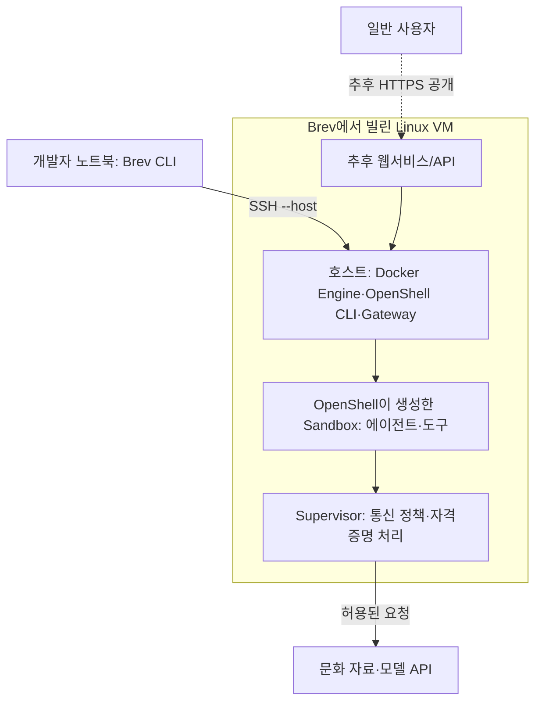

# Brev VM에 OpenShell 샌드박스 올리기

조사 기준: **2026-10-07, 한국 시간 / OpenShell v0.1.2 / Brev 공개 문서**. 이 문서는 공식 기능을 조합한 실행 절차다. **실제 Brev VM에서 설치·샌드박스 생성·정책 차단을 시험한 기록은 아니다.** 비용과 계정 권한을 확인한 뒤 아래 순서로 검증한다.

보안정책의 원리는 [상세 분석](../catalog/tools/openshell-security.md), 일반 사용자 접속까지의 설계는 [배포 준비](openshell-deployment.md), 크레딧·계정·운영은 [Brev 당일 가이드](brev-event-guide.md)를 따른다.

## 1. 정확히 무엇을 설치하는가

**Brev가 제공하는 Linux VM 안에서 OpenShell gateway를 실행하고, 그 gateway가 Docker로 격리된 작업 공간을 생성하는 구성**을 기본안으로 삼는다. Brev VM과 OpenShell sandbox는 별도의 계층이다.



| 단계 | 생기는 것 | 아직 완료되지 않은 것 |
|---|---|---|
| Brev VM 생성 | 실행할 서버와 접속 권한 | OpenShell 설치·보안정책 |
| OpenShell 설치 | gateway·CLI·prover와 설정 | 실제 sandbox·문화 서비스 |
| Sandbox 생성 | 정책 아래 실행되는 workload | 기능 구현·일반 사용자 공개 |
| 웹서비스 배포 | 사용자가 접근할 화면·API | 실제 작업·보안 검증까지 확인해야 완료 |

여기서는 **단일 VM + Docker + host에서 OpenShell CLI 실행** 경로를 설명한다. 개발 노트북에 OpenShell을 설치하거나 gateway 관리 포트를 인터넷에 열지 않아도 이 준비를 할 수 있다. Docker driver는 단일 호스트에서 sandbox를 실행하는 공식 경로다. [런타임 구조](https://docs.nvidia.com/openshell/v0.1.2/how-it-works/sandboxes/runtimes)

## 2. Brev 환경 선택: VM Mode와 `--host`

### 두 가지 출발 경로

| 경로 | 준비 방식 | 사용 판단 |
|---|---|---|
| VM 직접 구성 | VM host에 OpenShell과 우리 workload 이미지를 직접 준비 | 자체 문화 서비스의 실행 경계를 제어하려는 경우; 이 문서의 기본 경로 |
| NemoClaw Launchable | Brev의 준비된 NemoClaw 환경으로 시작 | 지원 에이전트와 blueprint를 재사용할 경우; 설치된 버전·정책·추가 구성을 별도 확인 |

Brev 공식 agent 안내는 NemoClaw Agent와 Generic Agent Sandbox Launchable, 수동 CPU 환경 생성을 소개한다. **Generic Agent Sandbox라는 이름만으로 OpenShell 설치를 증명할 수는 없다.** [공식 Brev agent 경로](https://docs.nvidia.com/brev/guides/ai-agents/agent-sandboxes)

2026-10-07 Aside 콘솔에서도 NemoClaw Launchable의 배포 화면과 자동 설치 안내를 확인했다. 실제 Deploy는 누르지 않았으며, 보이는 자원·요금은 선택된 설정의 화면값이지 본선 계정의 무료 자원 보장이 아니다. Launchable을 택하면 Configuration·설치 로그에서 실제 OpenShell/NemoClaw 버전을 확인한다. 기존 설치 위에 이 문서의 installer를 다시 실행하지 않는다.

NemoClaw가 관리하는 환경은 lifecycle·설정 변경을 해당 CLI 지침에 맞춰 수행한다. standalone OpenShell v0.1.2의 provider 절차와 다른 버전의 NemoClaw managed inference 절차를 섞지 않는다. [NemoClaw/OpenShell CLI 구분](https://docs.nvidia.com/nemoclaw/latest/user-guide/openclaw/reference/cli-selection-guide)

### 권장 시작점

Brev 콘솔에서 인스턴스를 만들 때 **VM Mode**를 선택하고, GPU가 필요한 작업인지 먼저 판단한다. 모델을 hosted API로 호출하는 최소 확인에는 GPU를 전달하지 않는다. 실제 CPU 인스턴스 제공 여부·메모리·디스크·요금은 현재 계정의 선택지로 확인한다.

Single Container/Compose 모드는 Brev가 준비한 작업 컨테이너 안으로 접속할 수 있다. 그 안에 OpenShell을 설치하면 systemd·Docker socket·seccomp 조건에서 문제가 날 수 있다. **OpenShell gateway는 우선 VM 호스트에 설치한다.** `brev shell <instance> --host`는 컨테이너 대신 호스트에 연결하는 공식 옵션이다. [Brev 컨테이너 모드](https://docs.nvidia.com/brev/guides/development-tools/custom-containers), [호스트 접속](https://docs.nvidia.com/brev/cli/connectivity)

### 생성 전에 확인

<!-- prev: 주최 측 조직 초대를 기다리는 것으로 잠정 이해 → 2026-10-07 공지·PDF pp.13–15·계정 화면으로 팀별 코드 등록과 팀원 초대 방식 확인. -->
본선은 **팀당 쿠폰을 등록한 조직에 팀원을 초대**하는 방식이다. 이 대화에서 $500 등록과 Member 초대 링크 생성을 확인했으며 실제 팀원 가입·인스턴스 SSH/Jupyter 접근은 별도 단계다. 링크·코드 원문은 문서에 저장하지 않는다. 인스턴스 생성은 사용자의 최신 결정에 따라 이후에 진행한다. [행사 요건](../operations/mission.md)

| 항목 | 선택/확인할 내용 |
|---|---|
| 조직·예산 | 해커톤에 사용할 조직, 실제 잔액, 시간당 요금, 종료 시각 |
| 실행 모드 | VM Mode, 호스트 SSH 가능 여부 |
| OS/CPU | Ubuntu/Debian 계열 Linux와 지원 아키텍처 우선 |
| Kernel | Landlock ABI 3 이상과 필요한 seccomp 기능; 보통 Linux 6.2 이상 또는 적합한 backport |
| Docker | Engine 28.0 이상, host 계정에서 daemon 접근 가능 |
| 지속성 | Stop 지원 여부, 재시작 시 보존되는 디스크·경로 |
| 네트워크 | 설치·image registry 접근, 이후 앱 공개 경로; 관리 포트 공개는 불필요 |

자원 수치는 서비스마다 달라 공식 최소 VM 사양으로 단정하지 않는다. 뒤 예제의 `--cpu 1 --memory 512Mi`는 작은 확인용 sandbox의 제한값이며 VM 전체 필요량이 아니다. VM에는 OS·Docker·gateway·supervisor·이미지 빌드에 필요한 여유가 별도로 필요하다. [OpenShell 지원 조건](https://docs.nvidia.com/openshell/v0.1.2/about/support-matrix)

### CLI 생성의 함정

`brev create 이름`만 실행하면 CPU 최소 서버가 선택되는 것이 아니다. 조사 시점 공식 문서의 기본 선택은 최소 VRAM 20GB·disk 500GB 등 GPU 조건을 사용한다. 콘솔에서 모드·자원을 확인하거나 정확한 instance type을 명시한다. `--dry-run`은 후보 조회이며 생성이 아니다. 아래 `INSTANCE_TYPE`은 현재 계정에서 확인한 값으로 바꾸기 전 실행하지 않는다.

```sh
brev create culture-host --type INSTANCE_TYPE --dry-run
```

후보·비용·권한을 확인한 다음에만 실제 생성한다. CLI 문서 사이에 legacy `start` 옵션도 있으므로 설치한 `brev --version`과 `brev create --help`를 대조한다. [인스턴스 생성·기본값](https://docs.nvidia.com/brev/cli/instance-creation)

공식 agent 안내의 `brev create my-agent` 후 CPU 선택 설명과 instance-creation의 GPU smart defaults 설명이 공존한다. 따라서 bare 명령이 CPU로 생성될 것이라고 확정하지 않고, 콘솔의 CPU 선택이나 정확한 type의 dry-run 결과를 우선한다.

## 3. 어느 터미널에서 실행하는가

| 표시 | 실행 위치 | 사용하는 명령 |
|---|---|---|
| **노트북** | 내 Mac/Windows/Linux | `brev login`, `brev shell`, `brev port-forward`, `brev copy` |
| **Brev 호스트** | `brev shell … --host`로 들어간 Linux VM | Docker·OpenShell 설치·생성·정책·logs·download |
| **Sandbox 내부** | `openshell sandbox exec`가 실행하는 격리 공간 | 자료 읽기·결과 쓰기·curl·우리 에이전트 |

`localhost`는 이 세 위치에서 각각 다르다. 노트북의 Docker에 이미지를 빌드하고 Brev gateway가 자동으로 그 이미지를 찾을 것이라고 가정하지 않는다. 이 절차는 **Brev 호스트의 Docker에 빌드하고 같은 호스트의 gateway가 사용**한다.

### 노트북에서 로그인·호스트 접속

Brev CLI 설치는 [공식 설치](https://docs.nvidia.com/brev/cli/getting-started)를 따른다. `TEAM_NAME`과 `culture-host`는 실제 조직·인스턴스 이름으로 바꾼다.

```sh
brev --version
brev login
brev org set TEAM_NAME
brev refresh
brev ls
brev shell culture-host --host
```

성공 기준은 의도한 조직의 인스턴스에 host 셸로 접속하는 것이다. Brev 로그인과 OpenShell gateway 인증, 모델 provider 키는 서로 별개다. [Brev 접속](https://docs.nvidia.com/brev/cli/connectivity)

## 4. Brev 호스트 사전 점검

아래 명령은 호스트에서 실행한다. 비밀이 들어갈 수 있는 전체 환경변수·설정 파일을 출력할 필요는 없다.

```sh
uname -m
uname -r
ps -p 1 -o comm=
systemd-detect-virt
docker version
docker info --format '{{.ServerVersion}}'
systemctl --user is-system-running
df -h .
free -h
```

| 관찰 | 해석/다음 행동 |
|---|---|
| PID 1이 일반 workload 프로세스, container 탐지 | 접속 위치를 다시 확인; `--host` 사용 |
| Docker permission denied | host 계정·daemon 권한을 확인; `sudo openshell`로 별도 root 설정을 만들지 않음 |
| `systemctl --user` bus 접속 실패 | 정상 SSH user session과 user service 사용 가능 여부 확인 |
| kernel 버전 충족 | 필요조건 일부만 확인; Landlock 비활성화나 seccomp 제한은 남을 수 있음 |
| 메모리·disk 부족 | 이미지 크기·동시 sandbox 수에 맞게 조정 |

Docker가 없거나 오래됐다면 [Docker의 Ubuntu 설치 안내](https://docs.docker.com/engine/install/ubuntu/)에 맞춰 host를 준비한다. Docker 그룹 권한은 강한 host 권한이므로 [공식 권한 안내](https://docs.docker.com/engine/install/linux-postinstall/)를 확인하고 운영자에게만 부여한다. workload에는 Docker socket을 전달하지 않는다.

호환성의 최종 판정은 OpenShell의 시작 시 보안 기능 검사와 아래 실제 workload 검사다. 커널·권한 오류를 만났다고 seccomp·Landlock을 끄거나 workload를 privileged로 바꾸지 않는다.

## 5. OpenShell v0.1.2 설치

**Brev 호스트, 같은 일반 사용자 계정**에서 진행한다. 다음은 설치 절차를 설명하는 명령이며 이 문서를 작성하면서 실행하지 않았다. installer를 먼저 저장·검토한 뒤 릴리스를 고정해 실행한다.

```sh
curl -fsSL https://raw.githubusercontent.com/NVIDIA/OpenShell/v0.1.2/install.sh -o openshell-install.sh
less openshell-install.sh
OPENSHELL_VERSION=v0.1.2 sh openshell-install.sh
openshell --version
openshell status
systemctl --user status openshell-gateway
```

공식 Linux 패키지 설치 경로는 CLI·prover·gateway를 제공하고 gateway를 systemd user service로 실행한다. 기본 gateway는 `https://127.0.0.1:17670`이고, 사용자 설정은 `~/.config/openshell/gateway.toml`이다. 설치 과정의 패키지 권한 요청과 설치 결과를 확인한다. [설치 안내](https://docs.nvidia.com/openshell/v0.1.2/about/installation), [v0.1.2 릴리스](https://github.com/NVIDIA/OpenShell/releases/tag/v0.1.2)

### Docker driver 고정과 로그아웃 후 유지

자동 탐지는 Kubernetes→Podman→Docker 순서여서, 이 문서의 경로를 재현하려면 설치된 `gateway.toml`의 **기존 섹션을 편집**해 Docker를 지정한다. 파일 전체를 아래 일부 내용으로 덮어쓰거나 중복 섹션을 추가하지 않는다. Gateway 설정 schema version 2와 sandbox 정책 version 1은 별개다.

```toml
[openshell.gateway]
compute_driver = "docker"
```

```sh
systemctl --user restart openshell-gateway
openshell status
sudo loginctl enable-linger "$USER"
loginctl show-user "$USER" -p Linger
```

`enable-linger`는 SSH 로그아웃 뒤 user service를 유지하기 위한 host 설정이다. sandbox를 `--detach`로 실행하는 것과 함께 사용한다. 노트북의 터미널을 닫은 뒤 재접속해서 gateway와 sandbox가 살아 있는지 실제로 확인한다. [설치·linger](https://docs.nvidia.com/openshell/v0.1.2/about/installation), [driver 선택](https://docs.nvidia.com/openshell/v0.1.2/how-it-works/sandboxes/runtimes)

## 6. 최소 확인용 이미지와 정책

아래는 **모델 키·GPU 없이 파일 접근과 통신 정책을 확인하는 하나의 합성 예제**다. 한국 문화 서비스가 구현된 이미지는 아니다. 파일을 만들 위치는 Brev 호스트의 작업 폴더이며, 세션마다 동일한 폴더에서 build/create한다.

### 이미지: `Dockerfile`

다음 내용을 `Dockerfile`로 저장한다. 출력은 `/workspace`, 읽기 자료는 `/opt/culture-source`, 금지 확인용 무해한 파일은 `/opt/culture-private`에 둔다. 자료 파일은 Linux 소유권상 UID 1000이 수정할 수 있게 하여, 뒤의 쓰기 거부를 OpenShell 파일 정책으로 확인한다.

```dockerfile
FROM ubuntu:24.04
RUN apt-get update && apt-get install -y --no-install-recommends ca-certificates curl python3 && rm -rf /var/lib/apt/lists/*
RUN mkdir -p /workspace /opt/culture-source /opt/culture-private
RUN printf 'Synthetic culture source\n' > /opt/culture-source/source.txt && printf 'TEST_ONLY\n' > /opt/culture-private/control.txt
RUN chown -R 1000:1000 /workspace /opt/culture-source /opt/culture-private
USER 1000:1000
WORKDIR /workspace
CMD ["sleep", "infinity"]
```

빌드 후 image ID를 기록한다. 아래 Ubuntu tag·apt 패키지는 변경될 수 있으므로 실제 시연 이미지는 확인한 digest·의존성으로 고정한다. v0.1.2는 Dockerfile을 `--from`으로 직접 빌드하지 않으므로 build를 먼저 한다.

```sh
docker build -t culture-sandbox:check .
docker image inspect culture-sandbox:check --format '{{.Id}}'
```

[공식 이미지 입력 방식](https://docs.nvidia.com/openshell/v0.1.2/how-it-works/sandboxes/overview#sandbox-images)

### 정책: `policy.yaml`

다음 내용을 같은 폴더의 `policy.yaml`로 저장한다. `/opt/culture-private`는 의도적으로 제외한다. 시스템 경로는 이 Ubuntu 확인 이미지의 실행을 위한 시작값이며, 실제 이미지에서는 존재·applied/skipped 상태를 대조한다.

```yaml
version: 1
filesystem_policy:
  include_workdir: false
  read_only: [/usr, /bin, /lib, /lib64, /etc, /proc, /dev/urandom, /opt/culture-source]
  read_write: [/workspace, /tmp, /dev/null]
landlock:
  compatibility: hard_requirement
network_policies: {}
```

처음에는 outbound network를 허용하지 않는다. Provider도 붙이지 않아 숨은 추가 권한 없이 확인한다. `hard_requirement`만으로 모든 나열 경로가 적용됐다고 단정하지 않고 실제 파일 검사와 로그를 확인한다. 이 예제는 공식 스키마에 맞춘 팀 작성안이며 runtime 미검증이다. [정책 스키마](https://docs.nvidia.com/openshell/v0.1.2/how-it-works/policies/schema)

## 7. 생성·접속·파일 경계 검증

**Brev 호스트**에서 실행한다. `--detach`는 생성 CLI가 종료돼도 canonical process가 실행되게 한다. `sleep infinity`는 확인용 sandbox를 유지하기 위한 주 프로세스다.

```sh
openshell sandbox create --name culture-check --from culture-sandbox:check --policy ./policy.yaml --cpu 1 --memory 512Mi --approval-mode manual --detach -- sleep infinity
openshell sandbox get culture-check
openshell policy get culture-check --base
openshell policy get culture-check --full
openshell sandbox exec -n culture-check -- id
```

성공 기준은 `Ready`, 기대한 non-root identity, 의도한 effective policy다. `openshell status`는 gateway 접속 성공일 뿐 이 단계의 성공을 대신하지 않는다. 시작 오류가 나면 먼저 `journalctl --user -u openshell-gateway --no-pager -n 80`을 확인한다. [sandbox 실행과 자원](https://docs.nvidia.com/openshell/v0.1.2/how-it-works/sandboxes/overview)

기존 gateway를 재사용하면 전역 정책·전역 승인 모드도 확인한다. `openshell settings get culture-check`에 gateway-wide `auto`가 있으면 sandbox의 `manual`보다 우선하므로 운영자 설정을 해결한 뒤 차단 검사를 한다. 전역 정책이 이 예제의 base를 대체하고 있으면 해당 정책 기준으로 기대 결과를 다시 정한다. [승인 모드 우선순위](https://docs.nvidia.com/openshell/v0.1.2/how-it-works/policies/advisor)

아래 명령은 한 줄씩 실행하며 기대한 실패를 개별 확인한다. 쓰기 거부 검사 후 hash가 같아야 한다.

```sh
openshell sandbox exec -n culture-check -- cat /opt/culture-source/source.txt
openshell sandbox exec -n culture-check -- sha256sum /opt/culture-source/source.txt
openshell sandbox exec -n culture-check -- sh -c 'printf "ok\n" > /workspace/result.txt'
openshell sandbox exec -n culture-check -- sh -c 'printf "changed\n" >> /opt/culture-source/source.txt'
openshell sandbox exec -n culture-check -- sha256sum /opt/culture-source/source.txt
openshell sandbox exec -n culture-check -- cat /opt/culture-private/control.txt
```

| 작업 | 기대 결과 |
|---|---|
| 자료 읽기 | `Synthetic culture source` |
| `/workspace/result.txt` 쓰기 | 성공, 파일에 `ok` |
| 자료 append | Permission denied 등 접근 거부, hash 불변 |
| private 파일 읽기 | 접근 거부; 파일이 없다는 오류로 통과 처리하지 않음 |

별도 셸이 필요하면 `openshell sandbox exec -n culture-check --tty -- /bin/bash`를 사용한다. `sandbox connect`는 이미 실행 중인 canonical process에 붙는 명령이므로, 이 예제에서는 새 셸이 아니라 `sleep`에 연결된다. [exec와 connect 차이](https://docs.nvidia.com/openshell/v0.1.2/observability/accessing-logs)

## 8. 통신 차단 → 좁은 허용 → 회수

다른 Brev 호스트 셸에서 `openshell logs culture-check --source sandbox`로 로그를 본다. 먼저 host에서 `https://example.com/`이 응답하는지 확인한 뒤 아래 sandbox GET을 실행한다. 이 GET에는 사용자 자료·키를 담지 않는다.

```sh
curl --max-time 15 -I https://example.com/
openshell sandbox exec -n culture-check -- curl --max-time 15 -I https://example.com/
```

host 정상 응답과 sandbox의 정책 deny를 함께 확인한다. 단순 timeout·DNS 실패만으로 차단 성공을 선언하지 않는다. `manual`이므로 요청에서 생긴 proposal을 자동 승인하지 않는다.

이어서 **curl만 example.com:443에 read-only REST로 접근**하도록 운영자가 명시적으로 규칙을 추가한다. 아래 복합 endpoint 표현은 공식 CLI 형식이다.

```sh
openshell policy update culture-check --rule-name example_read --binary /usr/bin/curl --add-endpoint example.com:443:read-only:rest:enforce --wait
openshell policy get culture-check --full
openshell sandbox exec -n culture-check -- curl --max-time 15 -I https://example.com/
openshell sandbox exec -n culture-check -- curl --max-time 15 -i -X POST https://example.com/
openshell policy update culture-check --remove-rule example_read --wait
openshell sandbox exec -n culture-check -- curl --max-time 15 -I https://example.com/
```

기대 결과는 HEAD 허용, POST의 **OpenShell L7 거부**, 규칙 회수 뒤 다시 통신 거부다. curl은 `--fail` 없이 HTTP 403을 받아도 exit code 0일 수 있으므로 응답·정책 이벤트를 확인한다. 원격 서버의 403/405와 OpenShell 거부를 구분한다. 이 검사는 실제 서비스의 외부 쓰기·반출 검증을 대신하지 않으며, 그 검사는 팀 소유 수신 endpoint와 request ID로 별도 수행한다.

`read-only`는 GET·HEAD·OPTIONS를 허용한다. 실제 문화 API에서는 필요한 method/path로 더 좁힌다. 정책 변경 시 기존 연결이 닫힐 수 있다. [정책 갱신 명령과 적용](https://docs.nvidia.com/openshell/v0.1.2/how-it-works/policies/manage-policies)

## 9. 결과 회수와 개발용 브라우저 연결

### 결과: sandbox → Brev 호스트 → 노트북

호스트 작업 폴더에서 다음을 실행한다. Download source는 sandbox의 canonical workdir인 `/workspace` 내부여야 한다.

```sh
mkdir -p ./retrieved
openshell sandbox download culture-check result.txt ./retrieved/
cat ./retrieved/result.txt
```

그 다음 노트북에서 Brev host의 실제 절대경로를 대상으로 파일을 복사한다. 컨테이너 모드를 사용했다면 `brev copy --help`로 host 복사 방식 지원을 확인하거나 host SSH의 `scp`를 사용한다. 일반 workload 컨테이너 경로와 host 경로를 혼동하지 않는다. 경로를 추측해 `/home/ubuntu`로 고정하지 않는다. [파일 전송](https://docs.nvidia.com/openshell/v0.1.2/how-it-works/sandboxes/overview#transfer-files)

### 개발 확인: 두 번의 포트 전달

확인 이미지에는 Python이 있으므로 `/workspace`만 제공하는 임시 HTTP 서버를 실행할 수 있다. 이것은 정상 파일 결과를 브라우저로 확인하는 용도이며 외부 사용자용 서비스가 아니다.

| 터미널 | 실행 위치 | 명령 |
|---|---|---|
| A | Brev 호스트 | `openshell sandbox exec -n culture-check -- python3 -m http.server 8000 --bind 127.0.0.1 --directory /workspace` |
| B | Brev 호스트 | `openshell forward start 8000 culture-check` |
| C | 노트북 | `brev port-forward culture-host --host --port 18000:8000` |

노트북 브라우저에서 `http://localhost:18000/result.txt`를 열어 `ok`를 확인한다. 순서는 **노트북 18000 → Brev host 8000 → sandbox loopback 8000**이다. 세 프로세스가 살아 있어야 하며 포트 충돌 시 양쪽 mapping을 함께 바꾼다. Brev port-forward와 OpenShell forward는 서로 다른 경계를 연결한다. [Brev 포트 전달](https://docs.nvidia.com/brev/cli/connectivity), [OpenShell 포트 전달](https://docs.nvidia.com/openshell/v0.1.2/how-it-works/sandboxes/overview#port-forwarding)

확인이 끝나면 A/C의 foreground 실행을 종료하고 B에서 `openshell forward stop 8000 culture-check`로 정리한다. 일반 이용자 접속은 이후 앱 HTTPS·인증·API 구조로 연결하며, 개발 터널 주소를 서비스 URL로 배포하지 않는다.

## 10. 실제 에이전트·모델을 연결할 때

앞 단계는 OpenShell 실행 경계만 확인했다. 다음에는 `sleep` 확인 이미지를 실제 에이전트 이미지로 바꾸고 파일·도구·API의 최소 권한을 작성한다.

1. 호스트에서 필요한 모델 provider profile을 검토·lint·import한다. 모델 선택·키·예산은 별도 확정한다.
2. credential을 gateway에 등록하고 대상 sandbox에만 provider를 attach한다.
3. effective policy에서 추가 host·binary·method/path를 확인하고 실제 모델 요청 1건을 검증한다.
4. [모델 호출 한도](model-policy.md)와 작업 timeout·취소·동시성 제어를 앱에 연결한다.
5. sandbox 작업을 웹서비스/API에 연결하고 [외부 사용자 배포 검증](openshell-deployment.md)을 수행한다.

Provider를 붙인 뒤 이미 실행 중인 프로세스에 환경변수가 자동 주입된다고 가정하지 않는다. 새 프로세스에서 placeholder를 받아 호출하는지 확인한다. 실제 키를 Dockerfile·입력 텍스트·로그에 넣지 않는다. [Inference 연결](https://docs.nvidia.com/openshell/v0.1.2/how-it-works/inference)

GPU가 필요할 때만 Brev의 GPU 장치·NVIDIA Container Toolkit·**Docker CDI**를 검증하고 `--gpu`를 추가한다. host의 `nvidia-smi` 성공만으로 sandbox GPU 접근이 확인되는 것은 아니다. OpenShell Docker driver의 GPU 경로는 CDI를 사용한다. [driver의 GPU 설정](https://docs.nvidia.com/openshell/v0.1.2/how-it-works/sandboxes/runtimes), [CDI 공식 안내](https://docs.nvidia.com/datacenter/cloud-native/container-toolkit/latest/cdi-support.html)

## 11. 자주 막히는 지점

| 증상 | 먼저 확인 | 처리 방향 |
|---|---|---|
| `systemctl --user` 실패 | host 접속인지, user session/bus인지 | `--host`로 재접속·정상 user service 환경 확보 |
| gateway 정상, sandbox는 시작 실패 | Landlock ABI·seccomp·Docker·이미지·메모리 | gateway/runtime 로그로 원인 분리; 호환 VM으로 변경 |
| 이미지 pull 실패 | host Docker에 빌드했는지, image ref·pull policy | 같은 daemon 사용; remote registry면 읽기 권한·digest 확인 |
| root user 거부 | 이미지 `USER`, 정책 `process` | non-root 사용자와 파일 소유권을 일치시킴 |
| 자료 읽기/출력 실패 | 정책 경로·소유권·workdir·존재 여부 | applied/skipped 로그와 실제 경로 확인 |
| 허용했다고 생각한 API가 deny | base/effective 차이, 실제 실행 binary·redirect | 필요한 정확한 규칙만 수정 |
| POST가 통과 | `enforcement: audit` 또는 넓은 다른 허용 규칙 | effective policy의 `enforce`와 규칙을 확인 |
| 모델 401/403 | provider 연결·profile endpoint·키 권한·새 프로세스 | 인증 실패와 정책 거부를 구분 |
| 노트북 localhost 접속 실패 | sandbox 서버→OpenShell forward→Brev forward 순서 | 호스트 기준부터 한 경계씩 검사 |
| SSH 종료 후 서비스 중단 | user service linger, detached canonical process | 유지 설정 후 외부/재접속 검사 |
| GPU가 host에서만 보임 | Docker CDI·sandbox `--gpu`·이미지 도구 | sandbox 내부에서 GPU 접근 재검증 |

OpenShell gateway가 메모리에 보관하는 최근 로그는 재시작 시 사라질 수 있다. 장기 보존이 필요하면 sandbox 파일 로그 또는 OCSF JSON export를 별도 저장하며 키·사용자 원문 노출을 점검한다. [로그와 보존](https://docs.nvidia.com/openshell/v0.1.2/observability/accessing-logs)

## 12. 중지·재시작·삭제와 비용

**Sandbox 중지와 Brev VM 중지는 별개다.** OpenShell sandbox를 모두 멈춰도 Brev VM이 실행 중이면 VM 비용은 계속 발생할 수 있다.

| 목적 | 위치와 작업 | 확인 |
|---|---|---|
| 잠시 sandbox만 중지 | host: `openshell sandbox stop culture-check` | `Stopped`, 결과·정책 보존 확인 |
| sandbox 재시작 | host: `openshell sandbox start culture-check` | `Ready`, canonical command 재실행, 허용/차단 재검사 |
| 확인용 sandbox 폐기 | host: 결과 회수 후 `openshell sandbox delete culture-check` | 삭제 접수뿐 아니라 실제 리소스 정리 확인 |
| VM 일시 중지 | 노트북: `brev stop culture-host` | Stop 지원·보존 경로·잔여 비용을 콘솔에서 확인 |
| VM 폐기 | 필요한 결과·설정 회수 후 콘솔/CLI Delete | VM 데이터 삭제·credential 회수·청구 상태 확인 |

gateway DB·credential 암호화 자료·TLS 인증서·설정은 일반 결과 파일과 분리해 보호한다. SQLite DB가 WAL 모드인 경우 실행 중 DB 파일 하나만 복사하지 말고 공식 backup 절차를 따른다. 초기 검증에서는 이미지를 다시 빌드하고 정책을 재적용할 수 있는 재현 경로를 먼저 확보한다. [gateway 저장·backup](https://docs.nvidia.com/openshell/v0.1.2/how-it-works/gateways/configuration), [Brev Stop/Delete](https://docs.nvidia.com/brev/cli/instance-management)

## 13. 이번 단계의 합격 조건

- Brev **host**에 접속하고 OpenShell v0.1.2 gateway를 확인했다.
- GPU·모델 키 없이 합성 sandbox가 `Ready`이며 non-root로 실행된다.
- 파일 읽기/출력은 성공하고 금지 읽기/수정은 실제로 거부된다.
- network deny→좁은 read-only 허용→POST deny→권한 회수를 확인했다.
- 결과 회수와 노트북 브라우저 확인, SSH 종료 뒤 유지, sandbox/VM 종료 절차를 각각 확인했다.

이 조건을 모두 확인해도 한국 문화 에이전트의 품질·모델 API·일반 사용자 배포가 완료된 것은 아니다. 실행자는 해당 환경에서 통과한 범위만 기록하고 미실행·실패·정책상 거부를 구분한다.
