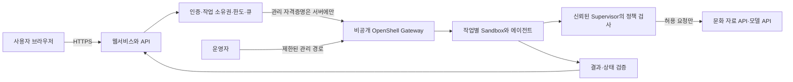

# OpenShell 실행 환경과 사용자 테스트 배포 준비

기준: **2026-10-07 / OpenShell v0.1.2**. 보안 원리·정책 항목은 [OpenShell 보안정책 분석](../catalog/tools/openshell-security.md)에 모았다. 이 문서는 환경 선택과 실제 배포 시 확인할 순서이며, 현재 서버 생성·설치·배포는 미실행이다.

공식 [미션·제출 요건](../operations/mission.md)은 **데모 URL 또는 실행 가이드**를 허용한다. 아래 외부 웹 접속은 우리 팀의 선택이며 사용자는 AWS 배포를 희망한다. 인스턴스 생성은 미션·주제를 정리한 뒤 진행한다.

Brev를 선택했다면 [VM 호스트 접속 → OpenShell 설치 → 샌드박스 검증 상세 절차](brev-openshell-setup.md)를 따른다. 파일·통신 정책 확인용 합성 예제와 노트북까지의 두 단계 포트 전달을 포함한다.

## 1. 완료 기준과 현재 범위

사용자의 새 요구는 **외부 사용자가 자신의 브라우저에서 접속해 직접 작업을 실행하고 결과를 확인할 수 있어야 한다**는 것이다. 따라서 기존 로컬 시연 계획에 외부 접속 가능한 배포가 추가된다. 계정 없는 공개 접속, 초대된 사용자만 접속, 심사 시간 이후 유지 여부는 아직 정해지지 않았다.

완료 기준 제안은 다음과 같다.

1. 개발자의 로그인·SSH 터널 없이 대상 사용자가 서비스 URL에 접속한다. 서비스 자체의 로그인은 확정한 방식에 따른다.
2. 화면에서 제출한 입력이 실제 OpenShell sandbox 안의 작업으로 연결되고 결과가 돌아온다.
3. 허용된 작업은 완료되고 금지 작업은 실제 정책 이벤트와 함께 차단된다.
4. 다른 사용자의 작업·결과·관리 API에 접근하지 못하며, 한도 초과·중단·재접속을 처리한다.
5. 개발 노트북을 끄거나 SSH를 끊어도 약속한 기간 동안 서비스가 동작한다.

## 2. 환경 선택

| 선택지 | 적합한 조건 | 준비·검증할 부분 | 현재 평가 |
|---|---|---|---|
| Brev VM + OpenShell | 제공 크레딧/계정이 있고 VM 접근이 빠름; GPU가 필요하면 함께 배치 | 실제 요금, OS·kernel, Docker, network, 접속 권한, 종료 조건 | 우선 비교 대상 |
| 일반 Linux VM + OpenShell | 보유 서버·클라우드 계정이 있고 공개 HTTPS 운영 가능 | 동일한 OpenShell 경계 조건, firewall·TLS·프로세스 유지 | 동등한 대안 |
| 로컬 Mac/Linux + 외부 터널 | 짧은 제한된 시연과 임시 접근만 필요 | 노트북 sleep·행사 network·터널 유지·접근 제한 | 임시 대안; 배포 완료 여부는 유지 요구에 따름 |
| 기존 Kubernetes | 이미 운영 가능한 cluster와 담당자가 있음 | Helm·workspace·인증·ingress·runtime 검증 | 준비된 기반이 있을 때만 |
| 일반적인 정적/서버리스 웹 호스팅 | UI를 빨리 배포하고 싶음 | 실제 sandbox를 실행할 별도 호스트와의 연결 | UI 후보; OpenShell 호스트 지원은 별도 확인 |

**팀 제안:** hosted 모델 API로 충분하면 CPU Linux 환경부터 비교한다. Brev 크레딧과 호환 VM이 바로 준비되면 Brev를 쓰고, 이미 검증된 Linux 서버가 있으면 이를 쓸 수 있다. GPU는 문화 서비스의 실제 모델·도구 요구를 확인한 후 결정한다. 가격·최소 사양·현재 가용량은 실측 전 확정하지 않는다.

Brev의 VM Mode는 Python·CUDA·Docker 환경을 제공하지만 OpenShell이 요구하는 Docker 버전·Landlock·seccomp가 해당 VM에서 동작하는지는 별도다. 컨테이너 이미지 하나를 실행하는 모드와 host에서 격리 runtime을 운영할 수 있는 VM 환경을 구분한다. [Brev Launchables](https://docs.nvidia.com/brev/concepts/launchables), [OpenShell 조건](https://docs.nvidia.com/openshell/v0.1.2/about/support-matrix)

## 3. 권장 연결 구조



서비스·gateway·sandbox를 같은 VM에 두더라도 논리적 권한과 network 경계를 분리한다. 그림은 팀의 권장 배치이며 구현 완료 상태가 아니다. 가장 단순한 시작점은 웹서비스/API와 단일 OpenShell 호스트다.

### 권한과 데이터 흐름

- 브라우저는 우리 작업 API만 호출한다. Gateway client 인증서·관리 token·모델 키를 전달하지 않는다.
- 서버가 검증한 입력을 요청별 작업에 전달한다. 사용자 텍스트를 shell command 문자열에 결합하지 않는다.
- sandbox 안에서 실제 에이전트·도구를 실행한다. 모델 호출과 도구 실행이 host에서 모두 끝나고 sandbox에서는 형식적 명령만 실행하는 구성은 피한다.
- 초기 구현은 **작업별 sandbox와 독립 출력 경로**를 우선 검토한다. 시작 시간이 길면 사전 준비한 sandbox pool을 고려하되, 반환 전에 상태·파일·provider·정책 초기화를 검증한다.
- 관리 호스트에서 결과를 제한된 형식으로 가져와 검증한 뒤 반환한다. 실시간 상태가 필요하면 앱 SSE/WebSocket 또는 polling의 중단·재접속을 검증한다.

작업별 sandbox는 팀의 격리 제안이다. 인스턴스 하나를 여러 방문자가 사용할 때의 인증·작업 소유권·큐·자원 상한을 OpenShell이 대신 완성해 주는 것은 아니다.

## 4. ‘접속 링크’ 네 종류의 차이

| 기능 | 실제 의미 | 사용자 테스트에 쓰려면 |
|---|---|---|
| Brev `port-forward` | 내 컴퓨터의 localhost로 SSH 터널 연결 | 개발자용 확인; 이 주소를 외부 사용자에게 보내는 것으로 배포되지 않음 |
| Brev Secure Link | Brev 인증으로 보호된 HTTP 서비스 접속 | 대상 사용자의 로그인·조직/권한·접근 흐름을 별도 계정에서 확인 |
| Brev Launchable 링크 | 같은 환경을 다른 사람이 새로 생성 | 기존 서비스 이용 URL과 다름; 방문자에게 VM 생성을 요구하지 않도록 구분 |
| OpenShell service exposure | sandbox 내부 loopback 서비스를 gateway 경유 URL로 연결 | local gateway면 local URL, remote gateway면 gateway 인증 필요 |

따라서 **Brev Secure Link나 OpenShell service URL이 생겼다는 사실만으로 일반 사용자 배포를 완료 처리하지 않는다.** Brev는 TCP/UDP 포트 공개도 제공하지만 모든 IP에 앱 포트를 연다고 TLS·서비스 인증·접근 제어가 자동으로 완성되지는 않는다. 일반 방문자 대상이라면 앱 전용 HTTPS reverse proxy/공개 진입점을 두는 경로를 검토한다. OpenShell 관리 포트를 익명 공개하지 않는다.

공식 근거: [Brev 접속·port forwarding](https://docs.nvidia.com/brev/cli/connectivity), [Brev Launchable의 Network와 공유 범위](https://docs.nvidia.com/brev/concepts/launchables), [OpenShell service forwarding](https://docs.nvidia.com/openshell/v0.1.2/how-it-works/sandboxes/overview#expose-long-running-services).

## 5. 실제 준비 순서

### A. 호스트와 접근 경로

서버 위치·예산·유지 시간·외부 접속 대상을 정하고 호스트를 선택한다. Brev를 쓴다면 [계정·크레딧·종료 가이드](brev-event-guide.md)를 재사용한다. 별도 VM도 같은 kernel/runtime 검사와 비용 상한이 필요하다.

확인할 값은 OS·아키텍처·kernel, Docker/Podman 버전, CPU/RAM·디스크 여유, image registry 접근, public ingress, 관리 경로다. `uname -r`, `docker version`, `docker info`는 사전 확인이며, 최종 합격은 OpenShell workload 생성과 실제 정책 검사로 판단한다. MicroVM이면 KVM 등 virtualization도 확인한다.

배포 후보가 조건을 충족하지 못하면 Landlock이나 인증을 끄는 대신 호스트/runtime을 바꾼다. OpenShell 필수 조건 때문에 단순 Docker 실행만으로 대체 완료하지 않는다.

### B. 버전 고정 설치와 서비스 유지

[v0.1.2 설치 안내](https://docs.nvidia.com/openshell/v0.1.2/about/installation)에 따라 선택한 서버에 설치한다. 공개 설치 스크립트는 내려받아 검토하고 릴리스를 고정한다. 실제 설치 시 CLI와 gateway의 버전 일치를 확인한다. 이 문서 작성 중에는 설치하지 않았다.

공식 installer는 CLI뿐 아니라 prover와 local gateway를 설치·기동한다. Linux에서는 systemd user service와 기본 loopback gateway를 사용한다. SSH 종료 뒤 유지하려면 user service의 linger 등 실행 지속 조건을 확인하고 앱 프로세스에도 재시작 정책을 둔다. `openshell status` 성공 이후에 sandbox 생성 검사를 진행한다.

gateway를 직접 원격 관리해야 한다면 [gateway 구성](https://docs.nvidia.com/openshell/v0.1.2/how-it-works/gateways/overview)의 인증·인증서·접속 안내를 따른다. public app HTTPS와 gateway 인증을 같은 것으로 간주하지 않는다.

### C. 이미지·정책·Provider

1. 문화 서비스의 에이전트와 최소 도구가 들어 있는 non-root workload 이미지를 빌드한다. 재현할 image tag/digest를 고정한다.
2. 읽기 자료·쓰기 출력·실행 파일의 실제 경로를 확인하고 base 정책과 boundary를 작성한다. 운영 중 package 설치 대신 필요한 의존성을 이미지에 준비한다.
3. 선택한 모델/API의 provider profile을 검토·lint·import하고 gateway에서 credential을 등록한다. 실제 값을 문서·이미지·Git에 넣지 않는다.
4. 필요한 provider만 attach하고 `manual` 승인·L7 `enforce`·파일 정책을 적용해 sandbox를 생성한다. CPU·메모리·작업 시간·동시 실행 상한도 정한다.
5. base/effective 정책 차이와 실제 allow/deny를 검증한다. 실패 이유를 확인하지 않고 wildcard로 풀지 않는다.

모델·API endpoint·계정이 미정이므로 복사해서 배포할 완성 정책이나 credential 명령을 지금 확정하지 않는다. [Provider 연결](https://docs.nvidia.com/openshell/v0.1.2/how-it-works/inference), [이미지·자원 설정](https://docs.nvidia.com/openshell/v0.1.2/how-it-works/sandboxes/overview)

### D. 운영 시 확인 명령

아래는 공식 v0.1.2 명령 형식이며 미실행이다. `culture-test`는 생성할 sandbox 이름의 예시이고, YAML 파일은 정책 설계 후 준비한다. Base 출력과 effective 출력은 운영자가 확인하며, 로그는 비밀정보를 제거한 뒤 공유한다.

```sh
openshell status
openshell policy get culture-test --base
openshell policy get culture-test --full
openshell policy list culture-test
openshell rule get culture-test --status pending
openshell-prover check candidate.yaml --boundary boundary.yaml
openshell sandbox exec -n culture-test -- id
```

수정한 정책은 `openshell policy set culture-test --policy policy.yaml --wait`로 적용할 수 있다. `--wait`와 revision 상태를 확인해 저장과 실제 적용을 구분하고 허용/차단 검사를 반복한다. 파일·process 변경은 재생성을 계획한다. [정책 관리](https://docs.nvidia.com/openshell/v0.1.2/how-it-works/policies/manage-policies), [Prover](https://docs.nvidia.com/openshell/v0.1.2/how-it-works/policies/prover)

### E. 앱 공개와 외부 검증

웹서비스가 sandbox 작업을 호출하는 경로를 먼저 완주한 뒤 HTTPS 진입점을 연결한다. 인증·작업 소유권·입력 크기·요청 빈도·큐·동시 실행 상한을 적용한다. [공통 모델 한도](model-policy.md)의 실행당 요청 40회·일일 4,000회·15초 간격·출력 1,024토큰·10단계를 재사용하며 재시도도 센다. 여러 프로세스/사용자가 각자 일일 한도를 모두 쓰지 않도록 공유 집계 범위를 정한다.

외부 컴퓨터의 새 브라우저 세션에서 접속→입력→sandbox 작업→결과까지 확인한다. 개발자 계정의 쿠키·SSH·localhost에 의존하면 실패다. SSE/WebSocket을 사용한다면 proxy timeout·buffering·연결 종료 후 재조회까지 확인한다. UI 공개와 실제 에이전트 연결 검증을 따로 판정한다.

### F. 유지·종료

health endpoint는 앱 기동뿐 아니라 gateway 연결·작업 수용 가능 상태를 구분한다. 장애 때 신규 작업을 보류하고 진행 중 작업의 상태를 조회할 수 있어야 한다. 로그·결과 보존 기간, 삭제 시점, 원격 관리 권한을 정한다.

서비스 종료 시 신규 입력을 막고 진행 중 작업을 정리한 뒤 필요한 결과를 회수한다. Brev/클라우드의 Stop·Delete 동작과 잔여 storage 비용은 실제 콘솔에서 확인한다. 복구에 필요한 설정과 이미지 참조를 보관하고, 임시 credential·공개 링크·운영 권한을 회수한다. 자동 종료를 사용할 경우 구현과 실제 작동까지 검증한다.

## 6. 배포 검증 표

| 검사 | 확인할 증거 | 실패 시 조치 |
|---|---|---|
| 호스트 경계 | sandbox 시작, Landlock 적용·누락 경로, non-root identity | 호환 호스트/runtime으로 변경 |
| 정상 사용 | 외부 브라우저 요청과 실제 run/sandbox 결과 연결 | API·worker·gateway 연결 단계별 확인 |
| 보안정책 | 허용 성공, 금지 파일/host/method 거부, 수신 측 상태 불변 | effective 정책과 binary·endpoint 확인 |
| 사용자 격리 | A/B 세션의 작업·결과 교차 접근 실패 | 요청 소유권·작업 공간 분리 수정 |
| 권한 확대 | 일반 이용자는 정책 승인·관리 API 접근 불가 | 앱/관리 경로 분리와 서버 인증 수정 |
| 한도·취소 | 동시 실행·요청 크기·호출 상한, 중단 시 실제 작업 종료 | 큐·timeout·취소 전달 보완 |
| 접속 지속 | SSH 종료·노트북 종료 후 외부 접근 성공 | 원격 service 유지·자동 재시작 설정 |
| 재시작 | 승인한 정책·필요 데이터 복구, 오래된 작업 상태 정리 | 저장·복구 계약 수정 |

정책 검사의 상세 입력과 오판 방지는 [보안 검증 표](../catalog/tools/openshell-security.md#6-증거를-남길-최소-검증)를 따른다. 모든 항목은 현재 미실행이다. 배포 방식·비용·동시성의 최종 선택은 실제 미션과 계정 정보가 온 뒤 구체화한다.
